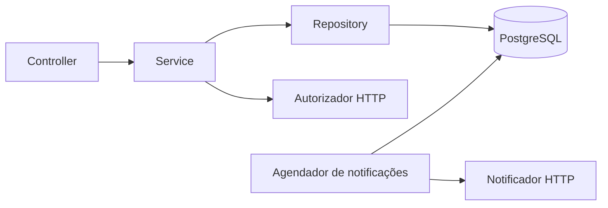

# Wallet API

API REST de transferências entre carteiras, desenvolvida como projeto de estudo e portfólio a partir do [desafio backend da PicPay](https://github.com/PicPay/picpay-desafio-backend). Não é um produto oficial da empresa.

O foco é uma implementação pequena, fácil de executar e explicar: regras de negócio explícitas, transações no PostgreSQL e testes dos cenários em que uma transferência pode falhar.

**Stack:** Java 21, Spring Boot 3.5, Spring Web, Spring Data JPA, PostgreSQL 17, Flyway, Maven, JUnit 5, Mockito, Testcontainers e Docker Compose. A CI executa os testes no GitHub Actions.

## Executar a demonstração

Pré-requisito: Docker com Docker Compose. Não é necessário instalar Java ou PostgreSQL no host.

```bash
docker compose -f compose.yml -f compose.mock.yml up --build -d
```

Esse comando inicia a API, o PostgreSQL e um simulador HTTP local para autorização e notificação. Na primeira execução, o build baixa as dependências. A API fica em `http://localhost:8081`.

```bash
curl http://localhost:8081/actuator/health
```

Após a inicialização, a resposta deve ser `{"status":"UP"}`. Para acompanhar a inicialização:

```bash
docker compose logs -f api
```

Para encerrar, preservando os dados:

```bash
docker compose -f compose.yml -f compose.mock.yml down
```

O volume mantém os cadastros entre execuções. Os próximos exemplos assumem um banco vazio; use os IDs devolvidos pela API quando já houver dados.

### 1. Cadastrar um usuário comum e um lojista

```bash
curl -i -X POST http://localhost:8081/users \
  -H 'Content-Type: application/json' \
  -d '{"fullName":"Ana Silva","document":"11111111111","email":"ana@example.com","password":"senha-de-exemplo","type":"COMMON"}'

curl -i -X POST http://localhost:8081/users \
  -H 'Content-Type: application/json' \
  -d '{"fullName":"Loja Exemplo","document":"22222222222222","email":"loja@example.com","password":"senha-de-exemplo","type":"MERCHANT"}'
```

Cada cadastro retorna `201 Created`, um cabeçalho `Location` e saldo inicial zero. Senha e documento não aparecem na resposta.

### 2. Adicionar saldo de demonstração

```bash
curl -X POST http://localhost:8081/users/1/deposits \
  -H 'Content-Type: application/json' \
  -d '{"value":100.00}'
```

Esse endpoint existe apenas com o perfil `demo`, ativado pelo Compose. Ele simula a entrada de dinheiro; não representa integração com um banco ou processador de pagamentos.

### 3. Transferir

```bash
curl -i -X POST http://localhost:8081/transfer \
  -H 'Content-Type: application/json' \
  -H 'Idempotency-Key: demo-transfer-001' \
  -d '{"value":25.00,"payer":1,"payee":2}'
```

Resposta `201 Created`:

```json
{
  "id": "a3f793b8-7e60-40c4-8a12-bb7e0c68f870",
  "value": 25.00,
  "payer": 1,
  "payee": 2,
  "createdAt": "2026-09-09T18:00:00Z",
  "notificationStatus": "PENDING"
}
```

O ID e a data são gerados pela aplicação. A transferência já está confirmada quando a API responde; `PENDING` descreve apenas a notificação. Consulte o endereço do cabeçalho `Location` para acompanhar a mudança para `SENT` ou `FAILED`. Reenvie a mesma operação com a mesma chave em caso de timeout; use uma chave nova para cada transferência diferente.

```bash
curl http://localhost:8081/users/1
curl http://localhost:8081/users/2
```

Os saldos devem ser `75.00` e `25.00`. Há mais exemplos em [docs/requests.http](docs/requests.http), compatível com IntelliJ HTTP Client e a extensão REST Client do VS Code.

## Endpoints

| Método | Caminho | Comportamento |
| --- | --- | --- |
| POST | `/users` | Cadastra usuário comum (`COMMON`) ou lojista (`MERCHANT`) |
| GET | `/users/{id}` | Consulta usuário e saldo |
| POST | `/users/{id}/deposits` | Adiciona saldo fictício; somente no perfil `demo` |
| POST | `/transfer` | Transfere conforme o contrato do desafio; exige `Idempotency-Key` |
| GET | `/transfer/{id}` | Consulta comprovante e situação da notificação |
| GET | `/actuator/health` | Verifica a saúde da aplicação e do banco |

Valores monetários devem ser positivos, com até 17 dígitos inteiros e duas casas decimais. O documento deve ter 11 ou 14 dígitos, sem pontuação. O e-mail é normalizado para minúsculas. Senhas têm de 8 a 64 caracteres e no máximo 72 bytes em UTF-8, limite do BCrypt utilizado.

### Erros

As respostas de erro seguem `application/problem+json`, com `status`, `title` e `detail`. Erros de validação também incluem `errors` com os campos inválidos.

| Status | Situação |
| --- | --- |
| 400 | JSON inválido, campos ausentes, valores fora do formato ou `Idempotency-Key` ausente/inválida |
| 403 | Autorizador recusou a transferência |
| 404 | Usuário ou transferência não encontrado |
| 409 | CPF/CNPJ ou e-mail já cadastrado, conflito com restrição do banco ou reutilização de chave com outro payload |
| 422 | Saldo insuficiente, lojista como pagador, mesma origem/destino ou limite de saldo |
| 503 | Autorizador indisponível ou tempo de espera pelo bloqueio da carteira excedido |

## Como funciona



Os pacotes são organizados por funcionalidade: `user`, `transfer`, `integration`, `notification`, `shared` e `demo`. Controllers cuidam do contrato HTTP; services coordenam regras e transações; repositories acessam o banco.

- **Dinheiro:** `BigDecimal` em Java e `NUMERIC(19,2)` no banco. Não há arredondamento silencioso de entradas com mais de duas casas decimais.
- **Carteira:** um objeto `@Embeddable` dentro de `User`, armazenado na tabela `users`. Como cada usuário tem exatamente uma carteira, não há necessidade de uma tabela separada nesta versão.
- **Atomicidade:** débito, crédito, comprovante e chave de idempotência são gravados na mesma transação. Recusa ou falha do autorizador desfaz tudo. Restrições SQL também impedem saldos negativos, documentos/e-mails duplicados e uso repetido da chave pelo mesmo pagador.
- **Idempotência:** `POST /transfer` exige `Idempotency-Key` com até 128 caracteres, persistida por pagador junto com uma impressão digital do payload. Repetir a chave com o mesmo conteúdo devolve o recibo original; usar a mesma chave com outro conteúdo retorna `409`.
- **Concorrência:** as duas carteiras são bloqueadas com `PESSIMISTIC_WRITE`, sempre pelo menor ID primeiro. Isso impede gasto duplo e evita deadlocks entre transferências em sentidos opostos.
- **Serviços externos:** `RestClient` com timeout de conexão de 2 segundos e leitura de 3 segundos. Autorização exige resposta explícita de sucesso; respostas inesperadas resultam em `503`.
- **Notificação:** o comprovante nasce com notificação pendente na mesma transação do pagamento. Um agendador consulta até dez pendências a cada ciclo, com intervalo de dez segundos após o ciclo anterior. Falhas são reagendadas para depois de 60 segundos, até cinco tentativas por padrão, e sobrevivem a reinícios. O estado `FAILED` encerra novas tentativas automáticas; `NOTIFICATION_MAX_ATTEMPTS` altera o limite. `FOR UPDATE SKIP LOCKED` impede dois workers de processarem simultaneamente o mesmo registro.
- **Segurança básica:** senha armazenada como hash BCrypt, DTOs sem exposição de entidades e contêiner da aplicação executado sem root.

## Testes

Pré-requisitos para executar fora de contêiner: JDK 21 e Docker acessível pelo usuário. O Maven Wrapper baixa o Maven na primeira execução.

```bash
# Testes unitários: não precisam de Docker
./mvnw test

# Suíte completa, incluindo PostgreSQL criado pelo Testcontainers
./mvnw verify
```

No Windows, use `mvnw.cmd`. Os testes de integração são executados pelo Maven Failsafe (`*IT`) e falham se o Docker não estiver disponível; não são pulados silenciosamente.

Os testes cobrem regras de saldo, precisão decimal, validação HTTP, unicidade e hashing, transferência entre usuários e para lojistas, rollback, gasto duplo, transferências em sentidos opostos, replay idempotente, chaves conflitantes, concorrência com a mesma chave, limite de retentativas e disponibilidade do depósito demo por perfil. Os clientes HTTP são exercitados contra um servidor local, incluindo timeout, recusa, resposta inválida e indisponibilidade. Os testes da aplicação usam PostgreSQL real e Mockito para controlar os serviços externos, sem depender da disponibilidade dos mocks públicos.

## Desenvolvimento local e serviços oficiais

```bash
docker compose up -d db
SERVER_ADDRESS=127.0.0.1 ./mvnw spring-boot:run -Dspring-boot.run.profiles=demo -Dspring-boot.run.arguments=--server.port=8081
```

O comando limita o servidor ao computador local. Sem o perfil `demo`, o endpoint de depósito não é registrado. O restante da API continua disponível.

Para usar os serviços oficiais com a aplicação em Docker, execute somente o Compose principal:

```bash
docker compose up --build -d
```

As URLs padrão são `https://util.devi.tools/api/v2/authorize` (`GET`) e `https://util.devi.tools/api/v1/notify` (`POST`). Em 09/09/2026, a consulta ao autorizador nesta implementação encontrou certificado TLS expirado; por isso a demonstração reproduzível usa simuladores locais. A aplicação mantém a validação TLS habilitada e trata essa falha como indisponibilidade.

| Variável | Padrão |
| --- | --- |
| `DB_URL` | `jdbc:postgresql://localhost:5433/wallet` |
| `DB_PORT` | `5433` — porta do PostgreSQL publicada pelo Compose |
| `API_PORT` | `8081` — porta da API publicada pelo Compose |
| `DB_USERNAME` | `wallet` |
| `DB_PASSWORD` | `wallet` — credencial apenas para desenvolvimento |
| `AUTHORIZATION_URL` | Autorizador oficial |
| `NOTIFICATION_URL` | Notificador oficial |
| `NOTIFICATION_MAX_ATTEMPTS` | `5` — máximo de tentativas automáticas de notificação |
| `SPRING_PROFILES_ACTIVE` | Sem perfil; Compose usa `demo` |

O arquivo `.env.example` serve de referência para o Compose. Para executar pela IDE/Maven, configure variáveis no ambiente; o Spring não carrega `.env` automaticamente.

O banco usa a porta `5433` no host para coexistir com instalações locais na porta `5432`. Dentro da rede Docker, a porta continua sendo `5432`. Se alterar `DB_PORT`, ajuste também `DB_URL` ao executar a aplicação fora do Docker.

## Limites e próximos passos

Este projeto prioriza o fluxo pedido no desafio. Autenticação e frontend estão fora do escopo; a API local permite operações por ID e não deve ser publicada como serviço financeiro. A validação de documento confere formato e unicidade, sem cálculo de dígitos verificadores.

A autorização externa ocorre enquanto as carteiras estão bloqueadas. Os timeouts limitam a espera, mas esse desenho reduz o throughput de carteiras muito movimentadas. É uma escolha simples para este porte.

As notificações têm entrega **pelo menos uma vez**: se o provedor receber a mensagem e a aplicação cair antes de registrar o sucesso, pode haver reenvio. O payload inclui `transferId` para permitir deduplicação pelo provedor; não há garantia de que o mock público a implemente. Após cinco falhas por padrão, o recibo fica `FAILED` e o agendador para de tentar.

`Idempotency-Key` protege contra repetição acidental, mas não autentica o pagador nem autoriza acesso à carteira. A API continua sem autenticação e deve permanecer local; não é um serviço financeiro nem deve ser publicada. Kafka, Redis e microsserviços não são necessários para demonstrar os fundamentos deste desafio.
